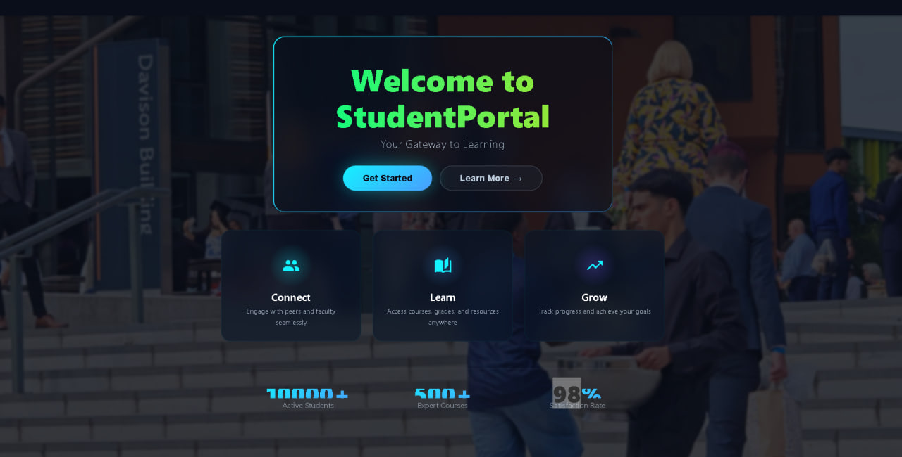
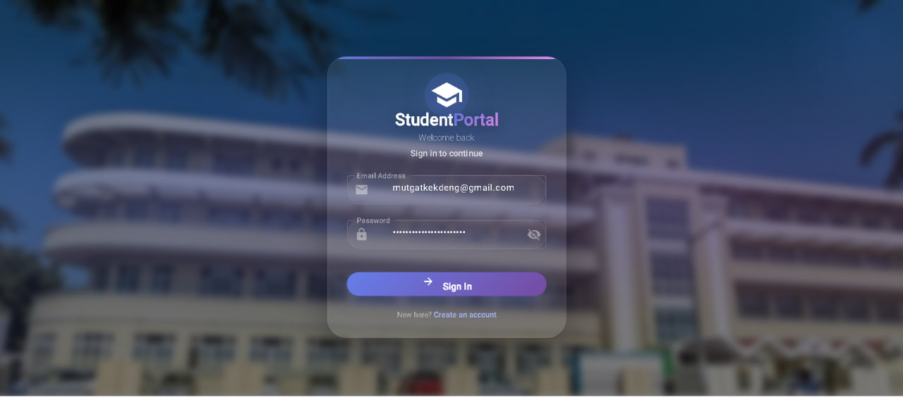
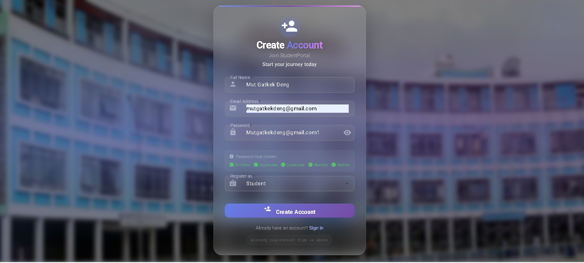
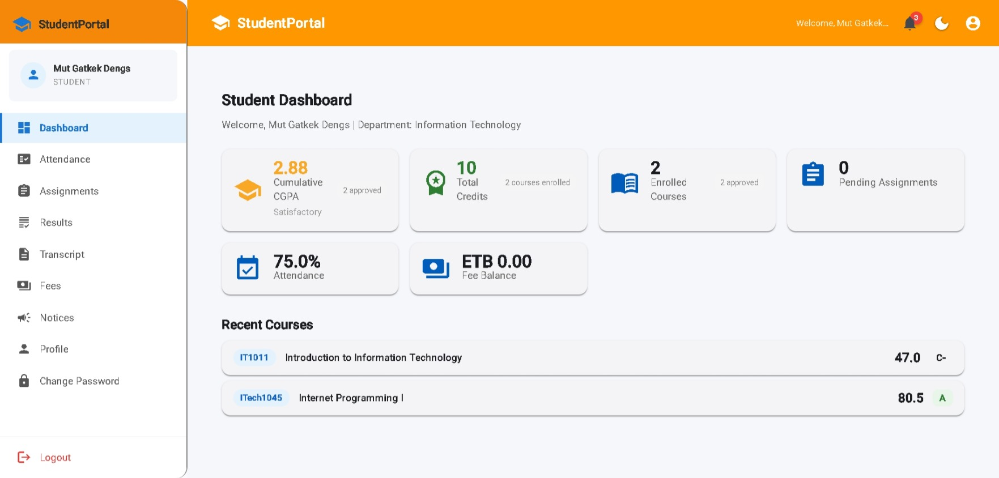
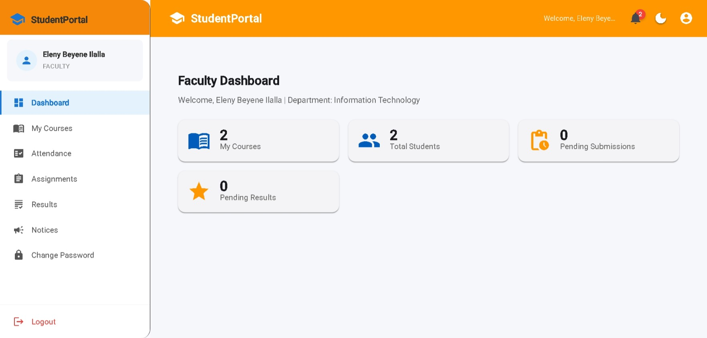
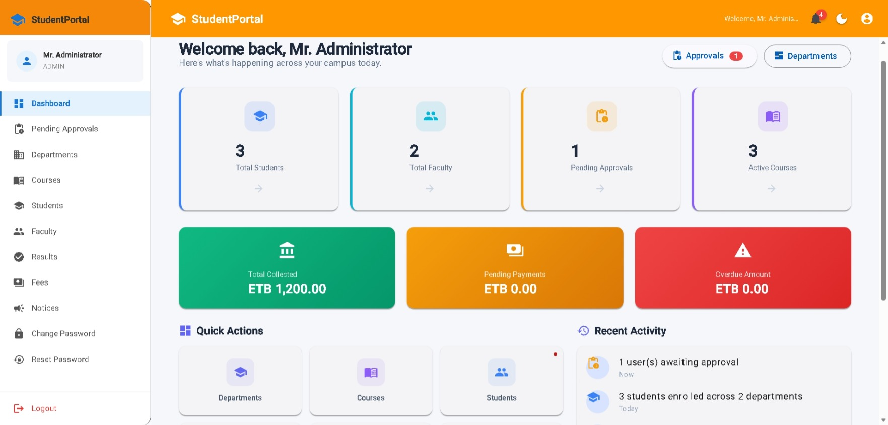

# StudentPortal

Full-stack StudentPortal system with ASP.NET Core backend and Angular frontend.  
Includes JWT authentication, SignalR notifications, and EF Core data access.

## Features

- Secure login with JWT
- Real-time notifications using SignalR
- Course enrollment and management
- Technical architecture with EF Core
- Angular frontend with responsive UI

## Screenshots

### Landing Page

### Login Page

### Registration Page

### Student Dashboard

### Faculty Dashboard

### Admin Dashboard

